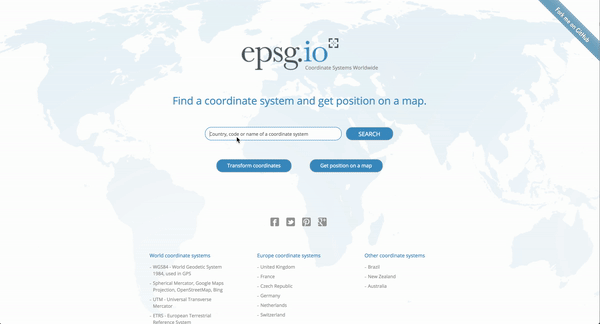

# Edit your Location (and optionally reproject into different coordinate system)
A MoreApp Widget to retrieve the GPS location and edit it afterwards. The version 0.0.2 introduced the possibility to transform the coordinates into a desired coordinate system.

### How to enable the reprojection
#### 1. You have to obtain a PROJ4 Definition string
This string defines how to perform the projection. Currently hundreds of coordinate systems are supported.

##### Method #1: Online on EPSG.io
 To find your desired projection definiton you can e.g. go to https://epsg.io and search for the target coordinate system you want to reproject your location data into. Then scroll down to the **Export** Section and select the **PROJ4** tab. Then copy the string.

This is an example of how a PROJ4 Definition String for the UTM Zone 32N looks like:

 ```
 +proj=utm +zone=32 +ellps=GRS80 +towgs84=0,0,0,0,0,0,0 +units=m +no_defs
 ```
 
 And the whole as a GIF Animation:
 

